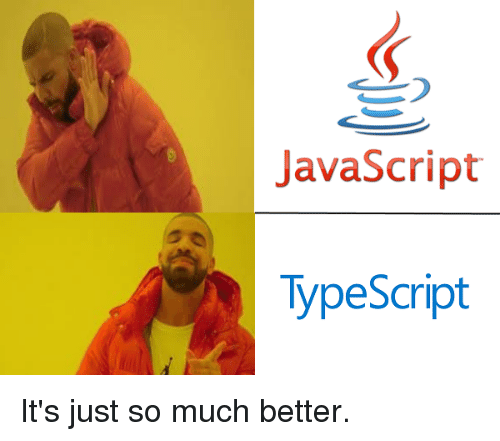

# Project: 0x04. Typescript



## Resources

### Read or watch:-

- [TypeScript in 5 minutes](https://www.typescriptlang.org/docs/handbook/typescript-in-5-minutes.html)
- [TypeScript documentation](https://www.typescriptlang.org/docs/handbook/basic-types.html)

## Project Setup

## Install NodeJS 12.11.x

```bash
curl -sL https://deb.nodesource.com/setup_12.x -o nodesource_setup.sh
sudo bash nodesource_setup.sh
sudo apt install nodejs -y
```

### Verify NodeJS and npm versions:-

```bash
nodejs -v
npm -v
```

## Install Jest, Babel, and ESLint

Run the following command in your project directory to install `Jest`, `Babel`, and `ESLint`:

```bash
npm install
```

## Configuration Files

Add the files below to your project directory

### `package.json`

<details>
<summary>Click to show/hide file contents</summary>

```bash
{
  "name": "typescript_dependencies",
  "version": "1.0.0",
  "description": "",
  "main": "index.js",
  "scripts": {
    "start-dev": "webpack-dev-server --open",
    "build": "webpack",
    "test": "jest"
  },
  "keywords": [],
  "author": "",
  "license": "ISC",
  "devDependencies": {
    "@babel/plugin-proposal-export-default-from": "^7.5.2",
    "@babel/preset-typescript": "^7.7.2",
    "@types/jest": "^24.0.23",
    "@typescript-eslint/eslint-plugin": "^2.4.0",
    "@typescript-eslint/parser": "^2.4.0",
    "clean-webpack-plugin": "^3.0.0",
    "fork-ts-checker-webpack-plugin": "^1.5.1",
    "html-webpack-plugin": "^3.2.0",
    "jest": "^24.9.0",
    "source-map": "^0.7.3",
    "ts-jest": "^24.1.0",
    "ts-loader": "^6.2.0",
    "typescript": "^3.6.4",
    "webpack": "^4.41.2",
    "webpack-cli": "^3.3.9",
    "webpack-dev-server": "^3.8.2"
  }
}
```

</details>

### `.eslintrc.js`

<details>
<summary>Click to show/hide file contents</summary>

```bash
module.exports =  {
  parser:  '@typescript-eslint/parser',
  extends:  [
    'plugin:@typescript-eslint/recommended',  // Uses the recommended rules from @typescript-eslint/eslint-plugin
  ],
  parserOptions:  {
    ecmaVersion:  2018,
    sourceType:  'module',
  },
  rules:  {
  },
};
```

</details>

### `tsconfig.json`

<details>
<summary>Click to show/hide file contents</summary>

```bash
{
  "compilerOptions": {
    "outDir": "./dist/",
    "sourceMap": true,
    "noImplicitAny": true,
    "module": "es6",
    "target": "es5",
    "allowJs": true,
    "moduleResolution": "node",
        "skipLibCheck": true
  }
}
```

</details>

### `webpack.config.js`

<details>
<summary>Click to show/hide file contents</summary>

```bash
const path = require("path");
const HtmlWebpackPlugin = require('html-webpack-plugin');
const { CleanWebpackPlugin } = require('clean-webpack-plugin');
const ForkTsCheckerWebpackPlugin = require('fork-ts-checker-webpack-plugin');

module.exports = {
  entry: "./js/main.ts",
  devtool: "inline-source-map",
  module: {
    rules: [
      {
        test: /\.tsx?$/,
        loader: 'ts-loader',
        options: {
          transpileOnly: true
        }
      }
    ]
  },
  resolve: {
    extensions: [".tsx", ".ts", ".js"]
  },
  devServer: {
    contentBase: "./dist"
  },
  plugins: [
    new ForkTsCheckerWebpackPlugin(),
    new CleanWebpackPlugin(),
    new HtmlWebpackPlugin({
      title: "Development"
    })
  ],
  output: {
    filename: "bundle.js",
    path: path.resolve(__dirname, "dist")
  }
};

```

</details>

- Don't forget to run `npm install` to install the dependencies specified in package.json.

## Tasks

| Task | File |
| ---- | ---- |
| 0. Creating an interface for a student | [task_0/js/main.ts](./task_0/js/main.ts), [task_0/package.json](./task_0/package.json), [task_0/.eslintrc.js](./task_0/.eslintrc.js), [task_0/tsconfig.json](./task_0/tsconfig.json), [task_0/webpack.config.js](./task_0/webpack.config.js) |
| 1. Let's build a Teacher interface | [task_1/js/main.ts](./task_1/js/main.ts), [task_1/webpack.config.js](./task_1/webpack.config.js), [task_1/tsconfig.json](./task_1/tsconfig.json), [task_1/package.json](./task_1/package.json) |
| 2. Extending the Teacher class | [task_1/js/main.ts](./task_1/js/main.ts) |
| 3. Printing teachers | [task_1/js/main.ts](./task_1/js/main.ts) |
| 4. Writing a class | [task_1/js/main.ts](./task_1/js/main.ts) |
| 5. Advanced types Part 1 | [task_2/js/main.ts](./task_2/js/main.ts), [task_2/webpack.config.js](./task_2/webpack.config.js), [task_2/tsconfig.json](./task_2/tsconfig.json), [task_2/package.json](./task_2/package.json) |
| 6. Creating functions specific to employees | [task_2/js/main.ts](./task_2/js/main.ts) |
| 7. String literal types | [task_2/js/main.ts](./task_2/js/main.ts) |
| 8. Ambient Namespaces | [task_3/js/main.ts](./task_3/js/main.ts), [task_3/js/interface.ts](./task_3/js/interface.ts), [task_3/js/crud.d.ts](./task_3/js/crud.d.ts) |
| 9. Namespace & Declaration merging | [task_4/package.json](./task_4/package.json), [task_4/tsconfig.json](./task_4/tsconfig.json), [task_4/js/subjects/Cpp.ts](./task_4/js/subjects/Cpp.ts), [task_4/js/subjects/Java.ts](./task_4/js/subjects/Java.ts), [task_4/js/subjects/React.ts](./task_4/js/subjects/React.ts), [task_4/js/subjects/Subject.ts](./task_4/js/subjects/Subject.ts), [task_4/js/subjects/Teacher.ts](./task_4/js/subjects/Teacher.ts) |
| 10. Update task_4/js/main.ts | [task_4/js/main.ts](./task_4/js/main.ts) |
| 11. Brand convention & Nominal typing | [task_5/js/main.ts](./task_5/js/main.ts), [task_5/package.json](./task_5/package.json), [task_5/webpack.config.js](./task_5/webpack.config.js), [task_5/tsconfig.json](./task_5/tsconfig.json) |

### Task 0: Creating an Interface for a Student

1. **Objective**: Define a `Student` interface and create a table using Vanilla JavaScript to display students' information.
2. **Key Points**:
   - Define the `Student` interface with `firstName`, `lastName`, `age`, and `location`.
   - Create two student objects and store them in an array `studentsList`.
   - Use Vanilla JavaScript to dynamically generate a table displaying each student's first name and location.

### Task 1: Building a Teacher Interface

1. **Objective**: Create a `Teacher` interface with specific attributes and the ability to add arbitrary attributes.
2. **Key Points**:
   - `Teacher` should have `firstName`, `lastName`, `fullTimeEmployee`, `yearsOfExperience` (optional), and `location`.
   - Allow adding any other attributes like `contract`.

### Task 2: Extending the Teacher Class

1. **Objective**: Define an interface `Directors` that extends the `Teacher` interface.
2. **Key Points**:
   - Add a new attribute `numberOfReports` to the `Directors` interface.

### Task 3: Printing Teachers

1. **Objective**: Implement a function `printTeacher` and define an interface for this function.
2. **Key Points**:
   - `printTeacher` should take `firstName` and `lastName` and return a string format `F. LastName`.

### Task 4: Writing a Class

1. **Objective**: Create a `StudentClass` with specific methods and constructor requirements.
2. **Key Points**:
   - Include methods `workOnHomework` and `displayName`.
   - Use interfaces to define constructor and class structure.

### Task 5: Advanced Types Part 1

1. **Objective**: Create `DirectorInterface` and `TeacherInterface` with specific methods and a function `createEmployee`.
2. **Key Points**:
   - Define the methods as specified in the task.
   - `createEmployee` should return either a `Director` or `Teacher` based on the salary argument.

### Task 6: Functions Specific to Employees

1. **Objective**: Implement `isDirector` and `executeWork` functions.
2. **Key Points**:
   - `isDirector` should be a type predicate.
   - `executeWork` should call specific methods based on whether the employee is a Director or Teacher.

### Task 7: String Literal Types

1. **Objective**: Create a `Subjects` literal type and a function `teachClass`.
2. **Key Points**:
   - `Subjects` should only allow 'Math' or 'History'.
   - `teachClass` should return a string based on the subject.

### Task 8: Ambient Namespaces

1. **Objective**: Work with ambient files and namespaces for database operations.
2. **Key Points**:
   - Write type declarations for CRUD functions.
   - Implement database operations using these declarations.

### Task 9: Namespace & Declaration Merging

1. **Objective**: Use namespaces and declaration merging in TypeScript.
2. **Key Points**:
   - Extend the `Teacher` interface and implement classes for different subjects with specific requirements and methods.

### Task 10: Update `main.ts`

1. **Objective**: Utilize the classes and interfaces created in previous tasks.
2. **Key Points**:
   - Create and export instances of the subjects and a teacher.
   - Demonstrate the functionality of each class and method.

### Task 11: Brand Convention & Nominal Typing

1. **Objective**: Implement nominal typing and brand properties in TypeScript.
2. **Key Points**:
   - Create `MajorCredits` and `MinorCredits` interfaces with a unique brand property.
   - Implement functions to sum credits.

- For each of these tasks, you'll need to apply your knowledge of TypeScript, including interfaces, types, classes, and functions. Remember to follow TypeScript best practices, such as using strict typing and leveraging interfaces for type checking and structure definition. These tasks are designed to give you hands-on experience with various TypeScript features and will be beneficial for your growth as a software engineer.
